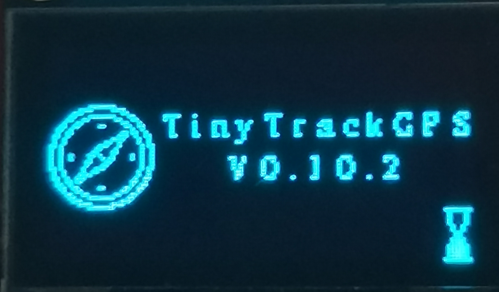
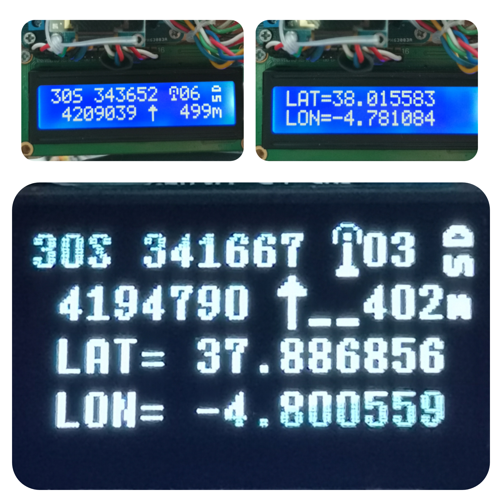

# TinyTrackGPS
[](README.md) []()

A simple track GPS to SD card logger.

&nbsp;

This program is written in C/C++ for Arduino © UNO R3 and other compatible microcontrollers based on Atmega328 and similar.

It is tested on:
* UNO R3 board (Arduino UNO compatible board based on Atmega328).
* ProMini 5v 16MHz (Arduino ProMini compatible board based on Atmega328p).
* Lgt8f328p (a replacement Arduino Pro Mini).Tested v0.1, v0.2 and v0.10.

[](LICENSE)

## List of componets

This project use components list above:

  * Arduino © UNO board or equivalent AVR.
  * NMEA 6 module.
  * MicroSD module.
  * LCD 16×2 char display module (wired or I2C), or OLED 0.96" I2C (SSD1306) (Optional).

### NO DISPLAY
Now you can use a minimal hardware to track GPS location. When no display use MicroSD module and card are mandatory. Comment all lines in 'config.h' file:
```C++
//#define DISPLAY_TYPE_SDD1306_128X64     // Para usar pantalla OLED 0.96" I2C 128x64 pixels
//#define DISPLAY_TYPE_LCD_16X2           // Para usar LCD 16 x 2 carateres.
//#define DISPLAY_TYPE_LCD_16X2_I2C       // Para usar LCD 16 x 2 carateres. I2C.
```
&nbsp;

### LCD 16x2

If you use LCD 16x2 char wired (6-wires), uncomment line like this in 'config.h' file:
```C++
#define DISPLAY_TYPE_LCD_16X2
```
&nbsp;

### LCD 16x2 I2C

If you use LCD 16x2 char I2C (4-wires), uncomment line like this in 'config.h' file:
```C++
#define DISPLAY_TYPE_LCD_16X2_I2C
```
&nbsp;

### OLED 0'96" 128x64 I2C

If you use OLED 0'96" 128X64 I2C (4-wires), uncomment line like this in 'config.h' file:
```C++
#define DISPLAY_TYPE_SDD1306_128X64
```
&nbsp;

### UST/UT Time.
_(Universal Summer Timer/Universal Standard Time)_

Now TinyTrackGPS record the info in local time. It is used Timezone library for that. Select 
the proper config at _line 74_ of `TinyTrackGPS.cpp` file. There are some info for time zone:
```C++
// Australia Eastern Time Zone (Sydney, Melbourne)
TimeChangeRule aEDT = {"AEDT", First, Sun, Oct, 2, 660};    // UTC + 11 hours
TimeChangeRule aEST = {"AEST", First, Sun, Apr, 3, 600};    // UTC + 10 hours
Timezone ausET(aEDT, aEST);

// Moscow Standard Time (MSK, does not observe DST)
TimeChangeRule msk = {"MSK", Last, Sun, Mar, 1, 180};
Timezone tzMSK(msk);

// Central European Time (Frankfurt, Paris)
TimeChangeRule CEST = {"CEST", Last, Sun, Mar, 2, 120};     // Central European Summer Time
TimeChangeRule CET = {"CET ", Last, Sun, Oct, 3, 60};       // Central European Standard Time
Timezone CE(CEST, CET);

// United Kingdom (London, Belfast)
TimeChangeRule BST = {"BST", Last, Sun, Mar, 1, 60};        // British Summer Time
TimeChangeRule GMT = {"GMT", Last, Sun, Oct, 2, 0};         // Standard Time
Timezone UK(BST, GMT);

// UTC
TimeChangeRule utcRule = {"UTC", Last, Sun, Mar, 1, 0};     // UTC
Timezone UTC(utcRule);

// US Eastern Time Zone (New York, Detroit)
TimeChangeRule usEDT = {"EDT", Second, Sun, Mar, 2, -240};  // Eastern Daylight Time = UTC - 4 hours
TimeChangeRule usEST = {"EST", First, Sun, Nov, 2, -300};   // Eastern Standard Time = UTC - 5 hours
Timezone usET(usEDT, usEST);

// US Central Time Zone (Chicago, Houston)
TimeChangeRule usCDT = {"CDT", Second, Sun, Mar, 2, -300};
TimeChangeRule usCST = {"CST", First, Sun, Nov, 2, -360};
Timezone usCT(usCDT, usCST);

// US Mountain Time Zone (Denver, Salt Lake City)
TimeChangeRule usMDT = {"MDT", Second, Sun, Mar, 2, -360};
TimeChangeRule usMST = {"MST", First, Sun, Nov, 2, -420};
Timezone usMT(usMDT, usMST);

// Arizona is US Mountain Time Zone but does not use DST
Timezone usAZ(usMST);

// US Pacific Time Zone (Las Vegas, Los Angeles)
TimeChangeRule usPDT = {"PDT", Second, Sun, Mar, 2, -420};
TimeChangeRule usPST = {"PST", First, Sun, Nov, 2, -480};
Timezone usPT(usPDT, usPST);
```

## Source

TinyTrackGPS is free software, see **License** section for more information. The code is based and get parts of the libraries above:

  * TinyGPS library, Mikal Hart (https://github.com/mikalhart/TinyGPS). Fixed version on 'lib'.
  * SdFat library, Bill Greiman (https://github.com/greiman/SdFat).
  * Lcdgfx library,Aleksei (https://github.com/lexus2k/lcdgfx)
  * U8g2 library, oliver (https://github.com/olikraus/u8g2).
  * Low-Power library, Rocket Scream Electronics (https://github.com/rocketscream/Low-Power).
  * LiquidCrystal library, Arduino Standard Libraries (Arduino IDE).
  * LiquidCrystal I2C library, John Rickman (https://github.com/johnrickman/LiquidCrystal_I2C).
  * UTMConversion library, Rafael Reyes (https://github.com/RafaelReyesCarmona/UTMConversion).
  * Timezone library, Jack Christensen (https://github.com/JChristensen/Timezone).
  * Time library, Paul Stoffregen (https://github.com/PaulStoffregen/Time).

## How to compile
### Config
Edit 'config.h' file before, to configure display type uncommenting the proper line:
```C++
// Descomentar solo uno de los displays utilizados.
//#define DISPLAY_TYPE_SDD1306_128X64     // Para usar pantalla OLED 0.96" I2C 128x64 pixels
#define DISPLAY_TYPE_LCD_16X2             // Para usar LCD 16 x 2 carateres.
//#define DISPLAY_TYPE_LCD_16X2_I2C       // Para usar LCD 16 x 2 carateres. I2C.
```
Modify Arduino pin where you connect the LCD 16x2 char:
```C++
// Definiciones para display LCD 16x2 caracteres.
#define RS 2
#define ENABLE 3
#define D0 4
#define D1 5
#define D2 6
#define D3 7
```
Modify I2C port for LCD 16x2 I2C: (connect in SCL and SDA pins)
```C++
// Define direccion I2C para LCD16x2 char.
#define I2C 0x27
```
### Coding TimeChangeRules
Normally these will be coded in pairs for a given time zone: One rule to describe when daylight (summer) time starts, and one to describe when standard time starts.

As an example, here in the Eastern US time zone, Eastern Daylight Time (EDT) starts on the 2nd Sunday in March at 02:00 local time. Eastern Standard Time (EST) starts on the 1st Sunday in November at 02:00 local time.

Define a **TimeChangeRule** as follows:

`TimeChangeRule myRule = {abbrev, week, dow, month, hour, offset};`

Where:

  * **abbrev** is a character string abbreviation for the time zone; it must be no longer than five characters.
  * **week** is the week of the month that the rule starts.
  * **dow** is the day of the week that the rule starts.
  * **hour** is the hour in local time that the rule starts (0-23).
  * **offset** is the UTC offset in minutes for the time zone being defined.

For convenience, the following symbolic names can be used:

**week:** First, Second, Third, Fourth, Last
**dow:** Sun, Mon, Tue, Wed, Thu, Fri, Sat
**month:** Jan, Feb, Mar, Apr, May, Jun, Jul, Aug, Sep, Oct, Nov, Dec

For the Eastern US time zone, the TimeChangeRules could be defined as follows:

```C++
TimeChangeRule usEDT = {"EDT", Second, Sun, Mar, 2, -240};  //UTC - 4 hours
TimeChangeRule usEST = {"EST", First, Sun, Nov, 2, -300};   //UTC - 5 hours
```
For Central European time zone (Frankfurt, Paris), TimeChangeRules could be as:
```C++
TimeChangeRule CEST = {"CEST", Last, Sun, Mar, 2, 120};     // Central European Summer Time
TimeChangeRule CET = {"CET ", Last, Sun, Oct, 3, 60};       // Central European Standard Time
```

For more information see Timezone info at: https://github.com/JChristensen/Timezone#readme
### Set the Time Zone

Change lines like above in `TinyTrackGPS.cpp` file, at line **74**, with appropriate definition for your time zone.

&nbsp;

If your time zone is Australia, you can use this lines:

&nbsp;

Timezone uses Time library so time is based on the standard Unix time_t.
The value is the number of seconds since Jan 1, 1970. And store in unsigned long variable. Arduino
Reference describe unsigned long as : ```Unsigned long variables are extended size variables for number storage, and store 32 bits (4 bytes). Unlike standard longs unsigned longs won’t store negative numbers, making their range from 0 to 4,294,967,295 (2^32 - 1).``` It is predict to not be afected with 2038 effect. For more information see [Unix Time](https://en.wikipedia.org/wiki/Unix_time) at Wikipedia, and [Year 2038 problem](https://en.wikipedia.org/wiki/Year_2038_problem). Assuming that timestamp is 4,294,967,295 (maximal value of unsigned long in Arduino, 2^32 - 1), it wil be in: **GMT: Sunday, 7 February 2106 6:28:15** when time_t overflow. Then time_t reset to 0 and date will be **GMT: Thursday, 1 January 1970 0:00:00**. Visit https://www.epochconverter.com/, an utility for Epoch & Unix Timestamp Conversion.

### Platformio
Run command `pio.exe run`.
```
Processing Uno (platform: atmelavr; board: uno; framework: arduino)
-------------------------------------------------------------------------------------------------Verbose mode can be enabled via `-v, --verbose` option
CONFIGURATION: https://docs.platformio.org/page/boards/atmelavr/uno.html
PLATFORM: Atmel AVR (3.4.0) > Arduino Uno
HARDWARE: ATMEGA328P 16MHz, 2KB RAM, 31.50KB Flash
DEBUG: Current (avr-stub) On-board (avr-stub, simavr)
PACKAGES:
 - framework-arduino-avr 5.1.0
 - toolchain-atmelavr 1.70300.191015 (7.3.0)
LDF: Library Dependency Finder -> http://bit.ly/configure-pio-ldf
LDF Modes: Finder ~ chain, Compatibility ~ soft
Found 14 compatible libraries
Scanning dependencies...
Dependency Graph
|-- <LiquidCrystal> 1.0.7
|-- <TinyGPS> 0.0.0-alpha+sha.db4ef9c97a
|-- <U8g2> 2.28.8
|   |-- <SPI> 1.0
|   |-- <Wire> 1.0
|-- <SdFat> 2.1.0
|   |-- <SPI> 1.0
|-- <LiquidCrystal_I2C> 1.1.4
|   |-- <Wire> 1.0
|-- <Low-Power> 1.81.0
|-- <UTMConversion> 1.0.0
|-- <Timezone> 1.2.4
|   |-- <Time> 1.6.1
|-- <SoftwareSerial> 1.0
Building in release mode
Compiling .pio\build\Uno\src\Display.cpp.o
Compiling .pio\build\Uno\src\TinyTrackGPS.cpp.o
Linking .pio\build\Uno\firmware.elf
Checking size .pio\build\Uno\firmware.elf
Advanced Memory Usage is available via "PlatformIO Home > Project Inspect"
RAM:   [=======   ]  68.6% (used 1404 bytes from 2048 bytes)
Flash: [========= ]  85.7% (used 27634 bytes from 32256 bytes)
Building .pio\build\Uno\firmware.hex
================================== [SUCCESS] Took 3.33 seconds ==================================
Environment    Status    Duration
-------------  --------  ------------
Uno            SUCCESS   00:00:03.332
================================== 1 succeeded in 00:00:03.332 ==================================
```
For upload to Arduino use Platformio enviroment or use `platformio.exe run --target upload` command on terminal.

### Use of memory (Arduino UNO or equivalent) V0.7 vs. V0.9
#### NO DISPLAY
Compile V0.7:
```
RAM:   [=====     ]  50.3% (used 1031 bytes from 2048 bytes)
Flash: [=======   ]  70.7% (used 22798 bytes from 32256 bytes)
```
Compile V0.9:
```
RAM:   [======    ]  58.6% (used 1200 bytes from 2048 bytes)
Flash: [========  ]  76.7% (used 24748 bytes from 32256 bytes)
```
#### LCD 16x2 I2C
Compile V0.7:
```
RAM:   [=======   ]  70.2% (used 1437 bytes from 2048 bytes)
Flash: [========= ]  86.0% (used 27748 bytes from 32256 bytes)
```
Compile V0.9:
```
RAM:   [========  ]  79.6% (used 1631 bytes from 2048 bytes)
Flash: [========= ]  90.2% (used 29100 bytes from 32256 bytes)
```
#### LCD 16x2 6-WIRED
Compile V0.7:
```
RAM:   [======    ]  59.2% (used 1213 bytes from 2048 bytes)
Flash: [========  ]  81.5% (used 26296 bytes from 32256 bytes)
```
Compile V0.9:
```
RAM:   [=======   ]  68.7% (used 1407 bytes from 2048 bytes)
Flash: [========= ]  85.7% (used 27646 bytes from 32256 bytes)
```
#### OLED 0'96" 128x64 I2C
Compile V0.7:
```
RAM:   [========  ]  79.7% (used 1632 bytes from 2048 bytes)
Flash: [==========]  96.2% (used 31032 bytes from 32256 bytes)
```
Compile V0.9:
```
RAM:   [========= ]  85.2% (used 1744 bytes from 2048 bytes)
Flash: [==========]  99.8% (used 32190 bytes from 32256 bytes)
```
## Changelog
### V0.10
  * LowPower library only when no display is defined, to reduce flash memory.
  * Connect NMEA 6 GPS module to digital pins 0, 1 (hardware serial). SoftwareSerial library don't use now. So reduce flash memory. 
  * Better support for LGT8F328P.
  * Use [LGTISP](LGTISP.md) when use LGT8F328P to burn TinyTrackGPS into board. No bootloader.
  * Added lcdgfx library from https://github.com/lexus2k/lcdgfx.
  * New logo for splash at start.
   &nbsp;

&nbsp;
### V0.9
  * Added Timezone library for local time log.
### V0.8
  * Added UTMConversion library for conversion to UTM coordinates. It has been implemented From library UTMconversion.h (TinyTrackGPS V0.7). Now it is an independent library.

### V0.7
  * Use Low-Power library to reduce power consumption and gain greater autonomy implementing the project portably using lithium batteries.
  * No display support for minimal implementation.
  * Fixed some errors when displays on LCD 16x2.
  * Fixed error when save log on SD. Sometimes data didn't save correctly.
### V0.6
  * Fixed error GPS log file when compiling for OLED 0'96".
  * Added wait animation for OLED 0'96" 128x64.
  * Written new procedure to save data in GPS log file.
  * Less global variables, so code with less size when compile it.
### V0.5
  * Added wait animation for LCD 16x2 on "Waitting for GPS signal..." screen.
  * Added support for OLED 0'96" 128x64. 
  * GPS log file set time for create and modify.
  * Use SdFat library, Bill Greiman, for better performance.
  * Remove switch for select visual data on LCD 16x2. Now data change automatically every 8 seconds between UTM and grades coordenates.

## Working

It works getting info from NMEA module every second and save it into de log file. 


Log file Format is:
```
HH:MM:SS,YY.YYYYYY,XX.XXXXXX,ALT,UTM (WGS86)
```
Like this:
```
12:42:47,37.990493,-4.785790,571,30S 343186 4206265
12:42:48,37.990276,-4.785741,571,30S 343190 4206240
12:42:49,37.990062,-4.785705,571,30S 343193 4206216
12:42:50,37.989860,-4.785694,571,30S 343193 4206194
...
```
Where:
  * HH - Hours from GPS UTC.
  * MM - Minutes.
  * SS - Seconds.
  * YY.YYYYYY - Degree of latitude.
  * XX.XXXXXX - Degree of longitude.
  * ALT - Altitude in meters.
  * UTM - Coordenates in UTM format(WGS84): Zone Band X Y (00A XXXXXX YYYYYYY)

&nbsp;

For conversion to UTM coordinates use UTMConversion library. (https://github.com/RafaelReyesCarmona/UTMConversion)

Example of use:

```C++
#include "UTMconversion.h"

float flat = 37.8959210;
float flon = -4.7478210;

GPS_UTM utm;

void setup() {
  char utmstr[] = "30S 123456 1234567";

  Serial.begin(9600);  

  utm.UTM(flat, flon);
  sprintf(utmstr, "%02d%c %ld %ld", utm.zone(), utm.band(), utm.X(), utm.Y());
  Serial.println(utmstr);
}

void loop() {

}
```

File is named as:

`YYYYMMDD.csv` Example: `20210216.csv`

Where:
  * YYYY - Year 4 digits format.
  * MM - Mouth.
  * DD - Day.

### NMEA Secuence from GPS Module.

I am using a Ublox NEO-6MV2 module for get possition and time from GPS System. When GPS signal is ok, the module send the above information through serial:
```
$GPRMC,091620.00,A,3753.16481,N,00447.76212,W,9.209,273.97,201021,,,A*75
$GPVTG,273.97,T,,M,9.209,N,17.064,K,A*03
$GPGGA,091620.00,3753.16481,N,00447.76212,W,1,03,5.72,511.8,M,47.7,M,,*47
$GPGSA,A,2,21,31,22,,,,,,,,,,5.81,5.72,1.00*0F
$GPGSV,2,1,06,01,51,098,32,03,64,025,28,06,14,305,,21,33,114,40*73
$GPGSV,2,2,06,22,46,053,21,31,09,057,37*75
$GPGLL,3753.16481,N,00447.76212,W,091620.00,A,A*78
```

It is very important how to program for get GPS information correctly. 
### Information on GPS NMEA sentences

You can get more information about [GPS - NMEA sentence information](http://aprs.gids.nl/nmea/) in the web page. Or [RF Wireless World](https://www.rfwireless-world.com/Terminology/GPS-sentences-or-NMEA-sentences.html) page. And [SatSleuth Electronic circuits page](http://www.satsleuth.com/GPS_NMEA_sentences.aspx).

All sentences of NMEA start with "$GP___" secuence.  
#### GPRMC sentence

GPRMC secuence is 'Recommended minimum specific GPS/Transit data'

Format is:
`$GPRMC,hhmmss.ss,A,LLLL.LLLL,a,YYYYY.YYYY,b,x.xxx,ccc.cc,ddmmyy,v.v,m,M*hh`

  * `hhmmss.ss` = UTC time: hh-hour, mm - minute, ss.ss - seconds with decimals.
  * `A` = Data status, navigation receiver warning (A=Ok, V=warning)
  * `LLLL.LLLL` = Latitude (ddmm.mmmm)
  * `a` = North/South ('N' or 'S')
  * `YYYYY.YYYY` = Longitude (dddmm.mmmm)
  * `b` = East/West = ('E' or 'W')
  * `x.xxx` = Speed over ground in knots
  * `ccc.cc` = True course in degrees
  * `ddmmyy` = UT date (dd-day, mm-mounth, yy-year)
  * `v.v` = Magnetic variation degrees (Easterly var. subtracts from true course)
  * `m` = East/West of variation ('E' or 'W')
  * `M` = Mode (A = Autonomous, D = DGPS, E =DR)
  * `*hh` = Checksum

`eg.: $GPRMC,091620.00,A,3753.16481,N,00447.76212,W,9.209,273.97,201021,,,A*75`

    091620.00    UTC Time 09:16:20
    A            Navigation receiver OK
    3753.16481   Latitude 37 deg. 53.16481 min.
    N            North
    00447.76212  Longitude 004 deg. 47.76212 min 
    W            West
    9.209        Speed over ground, Knots
    273.97       Course
    201021       UTC Date 10 November 2021
    A            Mode Autonomous
    *75          Checksum

#### GPVTG sentence

GPVTG sentence is 'Course and speed information relative to the ground'.

Format is:
`$GPVTG,ccc.cc,T,ccc.cc,M,x.xxx,U,ss.sss,K,M*03`

  * `ccc.cc` = True course in degrees
  * `T` = Reference (T = True heading)
  * `ccc.cc` = Course in degrees
  * `M` = Reference (M = Magnetic heading)
  * `x.xxx` = Speed in knots
  * `U` = Units (N = Knots)
  * `ss.sss` = Speed in km/h
  * `K` = Unit (K = Km/h)
  * `M` = Mode (A = Autonomous, D = DGPS, E =DR)
  * `*hh` = Checksum

`eg.: $GPVTG,273.97,T,,M,9.209,N,17.064,K,A*03`

#### GPGGA sentence

GPGGA sentence is 'Global positioning system fix data (time, position, fix type data)'.

Format is:
`$GPGGA,hhmmss.ss,LLLL.LLLL,a,YYYYY.YYYY,b,P,SS,H.HH,EEE.E,M,GG.G,M,A,ID*hh`

  * `hhmmss.ss` = UTC time: hh-hour, mm - minute, ss.ss - seconds with decimals.
  * `LLLL.LLLL` = Latitude (ddmm.mmmm)
  * `a` = North/South ('N' or 'S')
  * `YYYYY.YYYY` = Longitude (dddmm.mmmm)
  * `b` = East/West = ('E' or 'W')
  * `P` = Position Fix Indicator (0-Unavailable or invalid; 1-GPS SS Mode,valid; 2-Differencial GPS SS Mode,valid; 3-5 Not sopported)
  * `SS` = Satellites in use.
  * `H.HH` = HDOP (Horizontal Dilution of Precision)
  * `EEE.E` = Altitude
  * `M` = Unit (M=meters)
  * `GG.G` = Geoid Separation
  * `M` = Unit (M=meters)
  * `A` = Age of difference correction (seconds)
  * `ID` = Diff. ref. station ID
  * `*hh` = Checksum

`eg.: $GPGGA,091620.00,3753.16481,N,00447.76212,W,1,03,5.72,511.8,M,47.7,M,,*47`

    091620.00    UTC Time 09:16:20
    3753.16481   Latitude 37 deg. 53.16481 min.
    N            North
    00447.76212  Longitude 004 deg. 47.76212 min 
    W            West
    1            GPS SS Mode
    03           Satellites in use
    5.72         Horizontal Dilution of Precision
    511.8        Altitude
    M            Unit meters
    47.7         Geoid Separation
    M            Unit meters
    *47          Checksum

#### GPGSA and GPGSV sentences

Both are sentences about satellites information. GPGSA sentence is 'Active satellites' and GPGSV is 'Satellites in view'.

#### GPGLL sentence

GPGLL sentence is 'Geographic position, latitude, longitude'.

Format is:
`$GPGLL,LLLL.LLLL,a,YYYYY.YYYY,b,hhmmss.ss,A,M,*hh`

  * `LLLL.LLLL` = Latitude (ddmm.mmmm)
  * `a` = North/South ('N' or 'S')
  * `YYYYY.YYYY` = Longitude (dddmm.mmmm)
  * `b` = East/West = ('E' or 'W')
  * `hhmmss.ss` = UTC time: hh-hour, mm - minute, ss.ss - seconds with decimals.
  * `A` = Data status, navigation receiver warning (A=Ok, V=warning)
  * `M` = Mode (A = Autonomous, D = DGPS, E =DR)
  * `*hh` = Checksum

`eg.: $GPGLL,3753.16481,N,00447.76212,W,091620.00,A,A*78`

    3753.16481   Latitude 37 deg. 53.16481 min.
    N            North
    00447.76212  Longitude 004 deg. 47.76212 min 
    W            West
    091620.00    UTC Time 09:16:20
    A            Navigation receiver OK
    A            Mode Autonomous
    *78          Checksum

### Low Energy Comsuption
`Low-Power` - the library is used to reduce power consumption and gain greater autonomy implementing the project portably using lithium batteries. Use only when no display configuration.
Implemented in v0.4 first time and from v0.7. 

## TinyGPS library

### Versions prior V0.10

TinyGPS library works getting information from GPRMC and GPGGA sentences. It extract time, date, latitude, longitude, speed and course information from GPRMC sentence. And altitude, time, latitude, longitude, numbers of satellites in use and hdop information from GPGGA sentence.

The function ```bool TinyGPS::encode(char c)``` call to ```bool TinyGPS::term_complete()``` and return `true` when GPRMC or GPGGA sentence is decoded correctly. The above code on TinyTrackGPS:

&nbsp;

It is in ```setup()``` section. This code wait until GPRMC sentence is correctly recieved. Then config time and date whith the code: 

```C++
  utctime = makeTime(time_gps);
  localtime = TimeZone.toLocal(utctime);
```

Usually NEO6 module is config to 9600 bauds and with 1 Hz for transmit information. So, rest of sentences are ignored in ```setup()```.

In ```loop()``` the while loop get the first sentence from NEO6 module, it is GPRMC sentence.

&nbsp;

To get altitude information is needed to decode GPGAA sentence, so call ```GPSRefresh()``` to do that.

&nbsp;

### Fixed TinyGPS on V0.10

Fixed version is located on 'lib/TinyGPS_fixed'. Files are called 'TinyGPS_fixed.cpp' and 'FixedGPS_.h'.

The function ```bool TinyGPS::encode(char c)``` call to ```bool TinyGPS::term_complete()``` and return `true` when GPRMC _and_ GPGGA sentence is decoded correctly. So all information is decoded at same time. Now ```GPSRefresh()``` is no neccessary.

## Accuracy

NMEA 6 GPS module accuracy is similar to others GPS devices. In the picture can see it.

&nbsp;

  * `Ref` was at _(30S 341554 4194119)_ location exactly. 
  * `TinyGPS` was located at _(30S 341556 4194126)_, 7m error. 
  * `GPS device` reported _(30S 341553 4194111)_, 8m error. 

## Draw track on map

You can upload the file and get the draw on a map using [GPS Visualizer](https://www.gpsvisualizer.com/).

&nbsp;
&nbsp;
&nbsp;

Or using apps like AlpineQuest.

&nbsp;

## License

This file is part of TinyTrackGPS.

TinyTrackGPS is free software: you can redistribute it and/or modify it under the terms of the GNU General Public License as published by the Free Software Foundation, either version 3 of the License, or (at your option) any later version.

TinyTrackGPS is distributed in the hope that it will be useful, but WITHOUT ANY WARRANTY; without even the implied warranty of MERCHANTABILITY or FITNESS FOR A PARTICULAR PURPOSE.  See the GNU General Public License for more details.

You should have received a copy of the GNU General Public License along with TinyTrackGPS.  If not, see <https://www.gnu.org/licenses/>.

[](LICENSE)

## Authors

Copyright © 2019-2021 Francisco Rafael Reyes Carmona.
Contact me: rafael.reyes.carmona@gmail.com

## Credits

Compass icon at the beginning is from [Flaticon.es](https://www.flaticon.es) designed by [DinosoftLabs](https://www.flaticon.es/autores/DinosoftLabs)
and licensed by [free license](images/license-37862535_compass.pdf).
