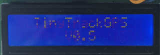
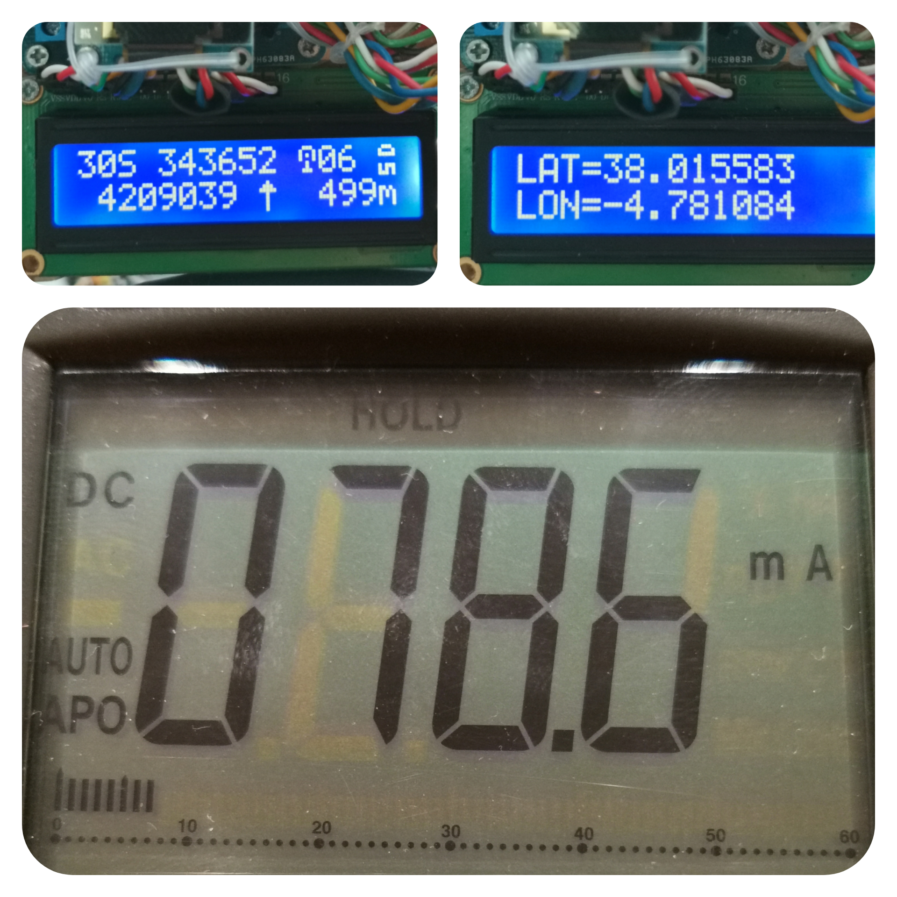

# TinyTrackGPS
[](README.md)
[]()

A simple track GPS to SD card logger.

&nbsp;
&nbsp;
&nbsp;
&nbsp;

This program is written in C/C++ for Arduino © UNO R3 and other compatible microcontrollers based on Atmega328 and similar.

It is tested on:
* UNO R3 board (Arduino UNO compatible board based on Atmega328).
* Lgt8f328p (a replacement Arduino Pro Mini).Tested v0.1 and v0.2.

[](LICENSE)

## List of componets

This project use components list above:

  * Arduino © UNO board or equivalent AVR.
  * NMEA 6 module.
  * MicroSD module.
  * LCD 16×2 char display module (wired or I2C), or OLED 0.96" I2C (SSD1306)
  * Bluetooth module. (Optional)
  * Switch for select visual data on LCD.(Pin8 and GND)

If you use LCD 16x2 char wired (6-wires), uncomment line like this in 'config.h' file:
```
#define DISPLAY_TYPE_LCD_16X2
```
&nbsp;

## Source

TinyTrackGPS is free software, see **License** section for more information. The code is based and get parts of the libraries above:

  * TinyGPS library, Mikal Hart (https://github.com/mikalhart/TinyGPS).
  * SdFat library, Bill Greiman (https://github.com/greiman/SdFat).
  * U8g2 library, oliver (https://github.com/olikraus/u8g2).
  * SoftwareSerial library, Arduino Standard Libraries (Arduino IDE). (only for debug)
  * LiquidCrystal library, Arduino Standard Libraries (Arduino IDE).
  * LiquidCrystal I2C library, John Rickman (https://github.com/johnrickman/LiquidCrystal_I2C).

## How to compile
### Config
Edit 'config.h' file before, to configure display type commenting the proper line:
```
// Descomentar solo uno de los displays utilizados.
//#define DISPLAY_TYPE_SDD1306_128X64     // Para usar pantalla OLED 0.96" I2C 128x64 pixels
#define DISPLAY_TYPE_LCD_16X2           // Para usar LCD 16 x 2 carateres.
//#define DISPLAY_TYPE_LCD_16X2_I2C       // Para usar LCD 16 x 2 carateres. I2C.
```
Modify Arduino pin where you connect the LCD 16x2 char:
```
// Definiciones para display LCD 16x2 caracteres.
#define RS 2
#define ENABLE 3
#define D0 4
#define D1 5
#define D2 6
#define D3 7
```
Modify I2C port for LCD 16x2 I2C: (connect in SCL and SDA pins)
```
// Define direccion I2C para LCD16x2 char.
#define I2C 0x27
```
### Platformio
Run command `pio.exe run`.
```
Processing Uno (platform: atmelavr; board: uno; framework: arduino)
---------------------------------------------------------------------------------------------------------------
Verbose mode can be enabled via `-v, --verbose` option
CONFIGURATION: https://docs.platformio.org/page/boards/atmelavr/uno.html
PLATFORM: Atmel AVR (3.4.0) > Arduino Uno
HARDWARE: ATMEGA328P 16MHz, 2KB RAM, 31.50KB Flash
DEBUG: Current (avr-stub) On-board (avr-stub, simavr)
PACKAGES:
 - framework-arduino-avr 5.1.0
 - toolchain-atmelavr 1.70300.191015 (7.3.0)
LDF: Library Dependency Finder -> http://bit.ly/configure-pio-ldf
LDF Modes: Finder ~ chain, Compatibility ~ soft
Found 11 compatible libraries
Scanning dependencies...
Dependency Graph
|-- <LiquidCrystal> 1.0.7
|-- <TinyGPS> 0.0.0-alpha+sha.db4ef9c97a
|-- <U8g2> 2.28.8
|   |-- <SPI> 1.0
|   |-- <Wire> 1.0
|-- <SdFat> 2.1.0
|   |-- <SPI> 1.0
|-- <LiquidCrystal_I2C> 1.1.4
|   |-- <Wire> 1.0
|-- <SoftwareSerial> 1.0
Building in release mode
Checking size .pio\build\Uno\firmware.elf
Advanced Memory Usage is available via "PlatformIO Home > Project Inspect"
RAM:   [========  ]  79.6% (used 1630 bytes from 2048 bytes)
Flash: [==========]  95.6% (used 30844 bytes from 32256 bytes)
========================================= [SUCCESS] Took 2.28 seconds =========================================
Environment    Status    Duration
-------------  --------  ------------
Uno            SUCCESS   00:00:02.277
========================================= 1 succeeded in 00:00:02.277 =========================================
```
For upload to Arduino use Platformio enviroment or use `platformio.exe run --target upload` command on terminal.

## Changelog
### V0.5
  * Added wait animation for LCD 16x2 on "Waitting for GPS signal..." screen.
  * Added support for OLED 0'96" 128x64. 
  * GPS log file set time for create and modify.
  * Use SdFat library, Bill Greiman, for better performance.

## Working

It works getting info from NMEA module every second and save it into de log file. Format is:
```
HH:MM:SS,YY.YYYYYY,XX.XXXXXX,ALT,UTM
```
Like this:
```
12:42:47,37.990493,-4.785790,571,30S 343186 4206265
12:42:48,37.990276,-4.785741,571,30S 343190 4206240
12:42:49,37.990062,-4.785705,571,30S 343193 4206216
12:42:50,37.989860,-4.785694,571,30S 343193 4206194
...
```
Where:
  * HH - Hours from GPS UTC.
  * MM - Minutes.
  * SS - Seconds.
  * YY.YYYYYY - Degree of latitude.
  * XX.XXXXXX - Degree of longitude.
  * ALT - Altitude in meters.
  * UTM - Coordenates in UTM format(WGS84): Zone Band X Y (00A XXXXXX YYYYYYY)

&nbsp;

For conversion to UTM coordinates it has been implemented library UTMconversion.h

Example of use:

```
#include "UTMconversion.h"

float flat = 37.8959210;
float flon = -4.7478210;

GPS_UTM utm;

void setup() {
  char utmstr[] = "30S 123456 1234567";

  Serial.begin(9600);  

  utm.UTM(flat, flon);
  sprintf(utmstr, "%02d%c %ld %ld", utm.zone(), utm.band(), utm.X(), utm.Y());
  Serial.println(utmstr);
}

void loop() {

}
```

File is named as:

`YYYYMMDD.csv` Example: `20210216.csv`

Where:
  * YYYY - Year 4 digits format.
  * MM - Mouth.
  * DD - Day.

Low-Power the library is trying to used to reduce power consumption and gain greater autonomy implementing the project portably using lithium batteries.
But yet not implemented. 

## Draw track on map

You can upload the file and get the draw on a map using [GPS Visualizer](https://www.gpsvisualizer.com/).

&nbsp;
&nbsp;
&nbsp;

Or using apps like AlpineQuest.

&nbsp;

## License

This file is part of TinyTrackGPS.

TinyTrackGPS is free software: you can redistribute it and/or modify it under the terms of the GNU General Public License as published by the Free Software Foundation, either version 3 of the License, or (at your option) any later version.

TinyTrackGPS is distributed in the hope that it will be useful, but WITHOUT ANY WARRANTY; without even the implied warranty of MERCHANTABILITY or FITNESS FOR A PARTICULAR PURPOSE.  See the GNU General Public License for more details.

You should have received a copy of the GNU General Public License along with TinyTrackGPS.  If not, see <https://www.gnu.org/licenses/>.

[](LICENSE)

## Authors

Copyright © 2019-2021 Francisco Rafael Reyes Carmona.
Contact me: rafael.reyes.carmona@gmail.com

## Credits

Compass icon at the beginning is from [Flaticon.es](https://www.flaticon.es) designed by [DinosoftLabs](https://www.flaticon.es/autores/DinosoftLabs)
and licensed by [free license](images/license-37862535_compass.pdf).
