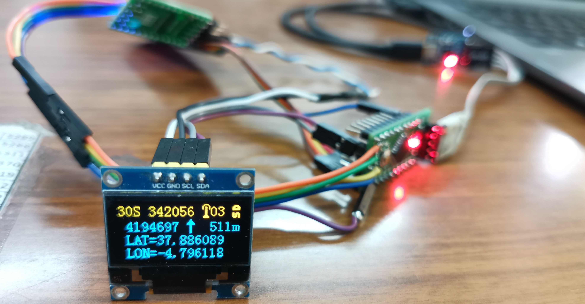
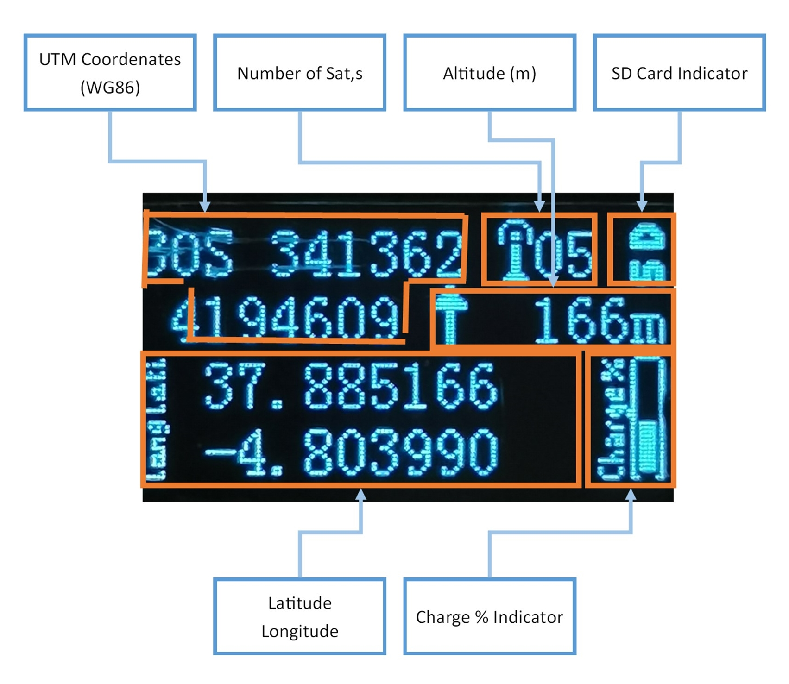
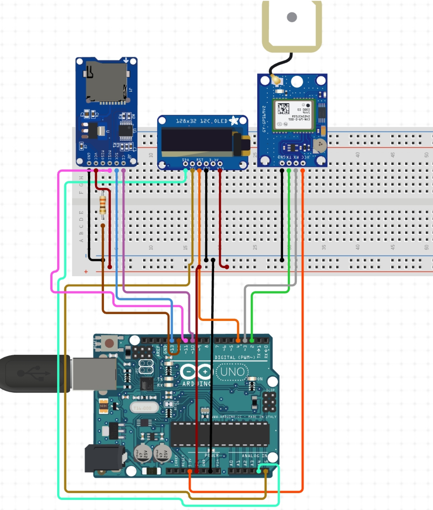
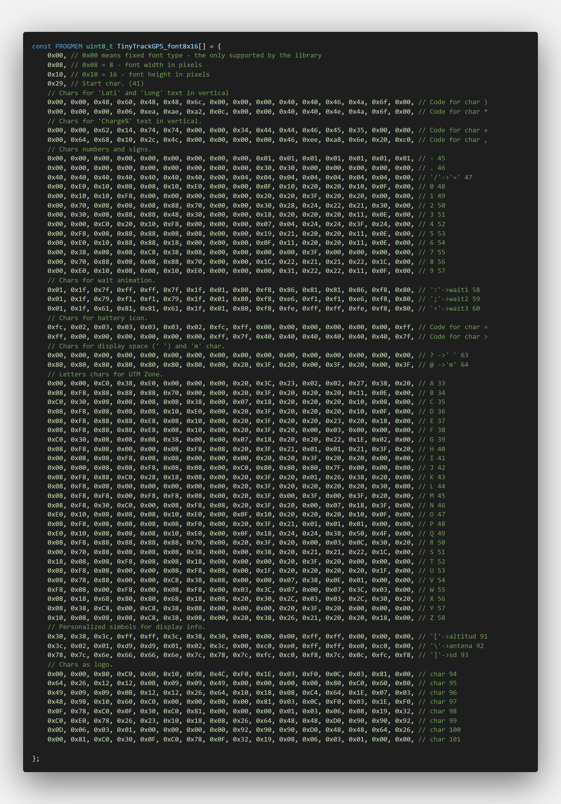
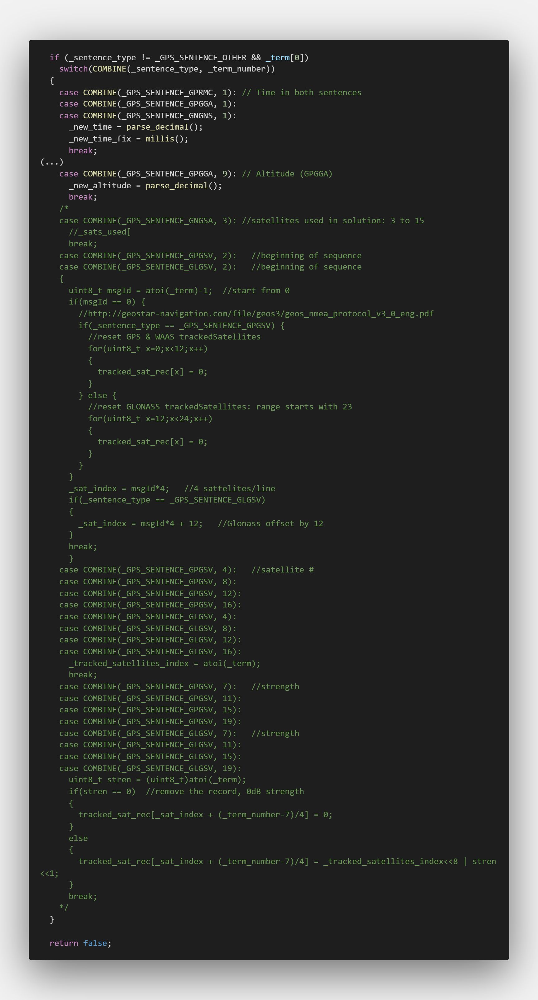

# TinyTrackGPS
&nbsp;

A simple track GPS to SD card logger. 

&nbsp;

&nbsp;
&nbsp;

## Features

This program is written in C/C++ for Arduino © UNO R3 and other compatible microcontrollers based on Atmega328 and similar. News functions and fix are tested and implemented on LGT8F328P board.

It is tested on:
* UNO R3 board (Arduino UNO compatible board based on Atmega328). Tested until v0.11, v0.13 and v0.14
* ProMini 5v 16MHz (Arduino ProMini compatible board based on Atmega328p). Tested until v0.11.
* Lgt8f328p (a replacement Arduino Pro Mini).Tested v0.1, v0.2 and since v0.10. (default option)

[](LICENSE)

When power on the first display shows version, logo, charge of battery and a waiting animation similar to hourglass. Device is waiting for GPS signal. When GPS signal is ready, it is showing the main display.

TinyTrackGPS features:
* Show GPS coordenates in Grades and UTM (WG86) formats.
* Save a tracklog in CSV format.
* Save time in tracklog on local time.
* Show battery charge.
* microSD card can be extracted and connected without powerdown or reset.
* Without memory card, it works as a simple GPS device.
### Main Display Parts

&nbsp;

## List of componets

This project use components list above:

  * Arduino © UNO board or equivalent AVR.
  * NMEA 6,8 GPS module.
  * MicroSD module and card.
  * LCD 16×2 char display module (wired or I2C), or OLED 0.96" I2C (SSD1306) (Optional).

  I use this components:

  * LGT8F328P LQFP-32 MiniEVB 32MHz board.
  * U-blox NEO-M8N GPS module. A concurrent reception module up to 3 GNSS (GPS, Galileo, GLONASS, BeiDou)
  * MicroSD module with MicroSD 4Gb Card FAT32 formatted.
  * SSD1306 0.96" 128x64 OLED I2C display module.

  Additional:
  * Lipo 3,7V 450mAh 403040 with protect.
  * MicroUsb charge module.

Current on this configuration is 60mA average.

&nbsp;

### NO DISPLAY
Now you can use a minimal hardware to track GPS location. When no display use MicroSD module and card are mandatory. Comment all lines in 'config.h' file:
```C++
//#define DISPLAY_TYPE_SDD1306_128X64     // Para usar pantalla OLED 0.96" I2C 128x64 pixels
//#define DISPLAY_TYPE_SDD1306_128X64_lcdgfx // Para usar pantalla OLED 0.96" I2C 128x64 pixels (lcdgfx library)
//#define DISPLAY_TYPE_LCD_16X2           // Para usar LCD 16 x 2 carateres.
//#define DISPLAY_TYPE_LCD_16X2_I2C       // Para usar LCD 16 x 2 carateres. I2C.
```
&nbsp;

### LCD 16x2

If you use LCD 16x2 char wired (6-wires), uncomment line like this in 'config.h' file:
```C++
#define DISPLAY_TYPE_LCD_16X2
```
&nbsp;

### LCD 16x2 I2C

If you use LCD 16x2 char I2C (4-wires), uncomment line like this in 'config.h' file:
```C++
#define DISPLAY_TYPE_LCD_16X2_I2C
```
&nbsp;

### OLED 0'96" 128x64 I2C

If you use OLED 0'96" 128X64 I2C (4-wires), uncomment line like this in 'config.h' file:
```C++
#define DISPLAY_TYPE_SDD1306_128X64 // Uses u8g2 library.
```
-- or --
```C++
#define DISPLAY_TYPE_SDD1306_128X64_lcdgfx // Uses lcdgfx library.
```

&nbsp;

### Lcdgfx library.

TinyTrackGPS uses this library by default. Use less flash memory and RAM. Fast running and no display flickering. For more information see at https://github.com/lexus2k/lcdgfx.

&nbsp;

The project define a new font (TinyTrackGPS_font8x16), a modified version of ssd1306xled_font8x16 of lcdgfx fonts (canvas/fonts/fonts.c). For information about create a new font visit: https://github.com/lexus2k/lcdgfx/wiki/How-to-create-new-font-for-the-library. 

&nbsp;

&nbsp;

&nbsp; &nbsp;

&nbsp;

### UST/UT Time.
_(Universal Summer Timer/Universal Standard Time)_

Now TinyTrackGPS record the info in local time. It is used Timezone library for that. See [Coding TimeChangeRules] section for information how to config.

## Source

TinyTrackGPS is free software, see **License** section for more information. The code is based and get parts of the libraries above:

  * TinyGPS library fork, Paul Stoffregen (https://github.com/PaulStoffregen/TinyGPS). Fork version to add NMEA Data Protocol v3.x and GLONASS support. Fixed version on 'lib'.
  * SdFat library, Bill Greiman (https://github.com/greiman/SdFat). Fixed version on 'lib'.
  * Lcdgfx library, Aleksei (https://github.com/lexus2k/lcdgfx).
  * U8g2 library, oliver (https://github.com/olikraus/u8g2).
  * Low-Power library, Rocket Scream Electronics (https://github.com/rocketscream/Low-Power).
  * LiquidCrystal library, Arduino Standard Libraries (Arduino IDE).
  * LiquidCrystal I2C library, John Rickman (https://github.com/johnrickman/LiquidCrystal_I2C).
  * UTMConversion library, Rafael Reyes (https://github.com/RafaelReyesCarmona/UTMConversion).
  * Timezone library, Jack Christensen (https://github.com/JChristensen/Timezone).
  * Time library, Paul Stoffregen (https://github.com/PaulStoffregen/Time).
  * Vcc library fork, LaZsolt (https://github.com/LaZsolt/Arduino_Vcc). Fork version to add support to LGT8F328P board and EMA implementation, more info about EMA (https://tttapa.github.io/Pages/Mathematics/Systems-and-Control-Theory/Digital-filters/Exponential%20Moving%20Average/C++Implementation.html). Source on 'lib'.
  * ConfigFile library fork, Rafael Reyes. It is based on SDConfig library fork, Claus Mancini [Fuzzer11] (https://github.com/Fuzzer11/SDconfig). The fork version uses templates to allocate space at compile time to prevent the sketch from crashing and it is modificated to support SdFat library.
  * EMA library fork, Rafael Reyes. It is based on EMA library v0.1, Rafael Reyes (https://github.com/RafaelReyesCarmona/EMA).
  * Semphr library, Rafael Reyes. It is a basic implementation of a control structure semaphore.


## How to compile
### Config
Edit 'config.h' file before, to configure display type uncommenting the proper line:
```C++
// Descomentar solo uno de los displays utilizados.
//#define DISPLAY_TYPE_SDD1306_128X64     // Para usar pantalla OLED 0.96" I2C 128x64 pixels
#define DISPLAY_TYPE_SDD1306_128X64_lcdgfx // Para usar pantalla OLED 0.96" I2C 128x64 pixels (lcdgfx library)
//#define DISPLAY_TYPE_SH1106_128X64         // Define para usar pantalla OLED 1.30" I2C 128x64 pixels (SH1106)
//#define DISPLAY_TYPE_LCD_16X2             // Para usar LCD 16 x 2 carateres.
//#define DISPLAY_TYPE_LCD_16X2_I2C       // Para usar LCD 16 x 2 carateres. I2C.
```
Modify Arduino pin where you connect the LCD 16x2 char:
```C++
// Definiciones para display LCD 16x2 caracteres.
#define RS 2
#define ENABLE 3
#define D0 4
#define D1 5
#define D2 6
#define D3 7
```
Modify I2C port for LCD 16x2 I2C: (connect in SCL and SDA pins)
```C++
// Define direccion I2C para LCD16x2 char.
#define I2C 0x27
```
Comment the line below for define Timezone in sketch, uncomment for configure with 'Time.cfg' file.
```C++
// Define para establecer localtime en tiempo de ejecución o de compilación.
#define TIMEZONE_FILE   // Comentar para establecer TimeZone (localtime) en tiempo de ejecución (Time.cfg)
```
### Coding TimeChangeRules
Normally these will be coded in pairs for a given time zone: One rule to describe when daylight (summer) time starts, and one to describe when standard time starts.

New feature is implemented to configure Timezone. It can be defined in the sketch or by a config file saved on SD card (Time.cfg).

#### Set the Time Zone in the sketch

To define time zone on the sketch define a **TimeChangeRule** as follows, normally will need a pair of this:

`TimeChangeRule myRule = {abbrev, week, dow, month, hour, offset};`

Where:

  * **abbrev** is a character string abbreviation for the time zone; it must be no longer than five characters.
  * **week** is the week of the month that the rule starts.
  * **dow** is the day of the week that the rule starts.
  * **hour** is the hour in local time that the rule starts (0-23).
  * **offset** is the UTC offset in minutes for the time zone being defined.

For convenience, the following symbolic names can be used:

**week:** First, Second, Third, Fourth, Last
**dow:** Sun, Mon, Tue, Wed, Thu, Fri, Sat
**month:** Jan, Feb, Mar, Apr, May, Jun, Jul, Aug, Sep, Oct, Nov, Dec

For the Eastern US time zone, the TimeChangeRules could be defined as follows:

```C++
TimeChangeRule usEDT = {"EDT", Second, Sun, Mar, 2, -240};  //UTC - 4 hours
TimeChangeRule usEST = {"EST", First, Sun, Nov, 2, -300};   //UTC - 5 hours
```
For Central European time zone (Frankfurt, Paris), TimeChangeRules could be as:
```C++
TimeChangeRule CEST = {"CEST", Last, Sun, Mar, 2, 120};     // Central European Summer Time
TimeChangeRule CET = {"CET ", Last, Sun, Oct, 3, 60};       // Central European Standard Time
```

For more information see Timezone info at: https://github.com/JChristensen/Timezone#readme

Change lines like above in `TinyTrackGPS.cpp` file, at line **111**, with appropriate definition for your time zone.

&nbsp;

If your time zone is Australia, you can use this lines:

&nbsp;

There are some info for time zone:
```C++
// Australia Eastern Time Zone (Sydney, Melbourne)
TimeChangeRule aEDT = {"AEDT", First, Sun, Oct, 2, 660};    // UTC + 11 hours
TimeChangeRule aEST = {"AEST", First, Sun, Apr, 3, 600};    // UTC + 10 hours
Timezone ausET(aEDT, aEST);

// Moscow Standard Time (MSK, does not observe DST)
TimeChangeRule msk = {"MSK", Last, Sun, Mar, 1, 180};
Timezone tzMSK(msk);

// Central European Time (Frankfurt, Paris)
TimeChangeRule CEST = {"CEST", Last, Sun, Mar, 2, 120};     // Central European Summer Time
TimeChangeRule CET = {"CET ", Last, Sun, Oct, 3, 60};       // Central European Standard Time
Timezone CE(CEST, CET);

// United Kingdom (London, Belfast)
TimeChangeRule BST = {"BST", Last, Sun, Mar, 1, 60};        // British Summer Time
TimeChangeRule GMT = {"GMT", Last, Sun, Oct, 2, 0};         // Standard Time
Timezone UK(BST, GMT);

// UTC
TimeChangeRule utcRule = {"UTC", Last, Sun, Mar, 1, 0};     // UTC
Timezone UTC(utcRule);

// US Eastern Time Zone (New York, Detroit)
TimeChangeRule usEDT = {"EDT", Second, Sun, Mar, 2, -240};  // Eastern Daylight Time = UTC - 4 hours
TimeChangeRule usEST = {"EST", First, Sun, Nov, 2, -300};   // Eastern Standard Time = UTC - 5 hours
Timezone usET(usEDT, usEST);

// US Central Time Zone (Chicago, Houston)
TimeChangeRule usCDT = {"CDT", Second, Sun, Mar, 2, -300};
TimeChangeRule usCST = {"CST", First, Sun, Nov, 2, -360};
Timezone usCT(usCDT, usCST);

// US Mountain Time Zone (Denver, Salt Lake City)
TimeChangeRule usMDT = {"MDT", Second, Sun, Mar, 2, -360};
TimeChangeRule usMST = {"MST", First, Sun, Nov, 2, -420};
Timezone usMT(usMDT, usMST);

// Arizona is US Mountain Time Zone but does not use DST
Timezone usAZ(usMST);

// US Pacific Time Zone (Las Vegas, Los Angeles)
TimeChangeRule usPDT = {"PDT", Second, Sun, Mar, 2, -420};
TimeChangeRule usPST = {"PST", First, Sun, Nov, 2, -480};
Timezone usPT(usPDT, usPST);
```

Timezone uses Time library so time is based on the standard Unix time_t.
The value is the number of seconds since Jan 1, 1970. And store in unsigned long variable. Arduino
Reference describe unsigned long as : ```Unsigned long variables are extended size variables for number storage, and store 32 bits (4 bytes). Unlike standard longs unsigned longs won’t store negative numbers, making their range from 0 to 4,294,967,295 (2^32 - 1).``` It is predict to not be afected with 2038 effect. For more information see [Unix Time](https://en.wikipedia.org/wiki/Unix_time) at Wikipedia, and [Year 2038 problem](https://en.wikipedia.org/wiki/Year_2038_problem). Assuming that timestamp is 4,294,967,295 (maximal value of unsigned long in Arduino, 2^32 - 1), it wil be in: **GMT: Sunday, 7 February 2106 6:28:15** when time_t overflow. Then time_t reset to 0 and date will be **GMT: Thursday, 1 January 1970 0:00:00**. Visit https://www.epochconverter.com/, an utility for Epoch & Unix Timestamp Conversion.

#### Set the Time Zone in the 'Time.cfg' file

Time Zone can be established by reading settings from a configuration file on an SD card. Use the same rules that is explained above for `TimeChangeRule`. If file 'Time.cfg' isn`t place on SD card or Card not inserted, UTC time will take for default. **Card must be placed on power on to config Time Zone.**

First section is rule for Summer Time of your region (UST), second one, it is for Standard Time. (UT)

Example file 'Time.cfg' for Central European Time (Frankfurt, Paris)
**File format: ```<name>=<value>```** 
```conf
# UST conf.
USTw=0
USTd=1
USTm=3
USTh=2
USTo=120

# UT conf.
UTw=0
UTd=1
UTm=10
UTh=3
UTo=60
```

Change the values with appropiate set of **w**.-'week', **d**.-'dow', **m**.-'month', **h**.-'hour' and **o**.-'offset'. Don`t change the names.

  * **week** - 0-Last, 1-First, 2-Second, 3-Third, 4-Fourth
  * **dow** - 1-Sun, 2-Mon, 3-Tue, 4-Wed, 5-Thu, 6-Fri, 7-Sat
  * **month** - 1-Jan, 2-Feb, 3-Mar, 4-Apr, 5-May, 6-Jun, 7-Jul, 8-Aug, 9-Sep, 10-Oct, 11-Nov, 12-Dec
  * **hour** - 0 - 23 hours.
  * **offset** - 0 - (+/-)720 minutes.

  It is used some correlation with constants defined for TimeChangeRules in `Timezone.h`:
```C++
// convenient constants for TimeChangeRules
enum week_t {Last, First, Second, Third, Fourth}; 
enum dow_t {Sun=1, Mon, Tue, Wed, Thu, Fri, Sat};
enum month_t {Jan=1, Feb, Mar, Apr, May, Jun, Jul, Aug, Sep, Oct, Nov, Dec};
```

### Platformio
Run command `pio.exe run`.
```
Processing LGT_ISP (board: LGT8F328P; framework: arduino; platform: lgt8f)
---------------------------------------------------------------------------------------------------
Verbose mode can be enabled via `-v, --verbose` option
CONFIGURATION: https://docs.platformio.org/page/boards/lgt8f/LGT8F328P.html
PLATFORM: Logic Green boards (1.0.1) > LGT8F328P
HARDWARE: ATMEGA328P 32MHz, 2KB RAM, 32KB Flash
PACKAGES:
 - framework-lgt8fx 1.0.6
 - toolchain-atmelavr 3.70300.0 (7.3.0)
LDF: Library Dependency Finder -> https://bit.ly/configure-pio-ldf
LDF Modes: Finder ~ chain, Compatibility ~ soft
Found 28 compatible libraries
Scanning dependencies...
Dependency Graph
|-- <LiquidCrystal> 1.0.7
|-- <U8g2> 2.32.10
|   |-- <SPI> 1.0
|   |-- <Wire> 1.0
|-- <LiquidCrystal_I2C> 1.1.4
|   |-- <Wire> 1.0
|-- <Low-Power> 1.81.0
|-- <UTMConversion> 1.1.0
|-- <Timezone> 1.2.4
|   |-- <Time> 1.6.1
|-- <lcdgfx> 1.1.2
|   |-- <SPI> 1.0
|   |-- <Wire> 1.0
|-- <ConfigFile>
|   |-- <SdFat> 2.1.2
|   |   |-- <SPI> 1.0
|-- <SdFat> 2.1.2
|   |-- <SPI> 1.0
|-- <Semphr>
|-- <TinyGPS_GLONASS_fixed>
|-- <Vcc>
|   |-- <EMA>
Building in release mode
Compiling .pio\build\LGT_ISP\src\Display.cpp.o
Linking .pio\build\LGT_ISP\firmware.elf
Checking size .pio\build\LGT_ISP\firmware.elf
Advanced Memory Usage is available via "PlatformIO Home > Project Inspect"
RAM:   [========  ]  82.6% (used 1692 bytes from 2048 bytes)
Flash: [==========]  97.5% (used 31950 bytes from 32768 bytes)
=================================== [SUCCESS] Took 7.37 seconds ===================================

Environment    Status    Duration
-------------  --------  ------------
LGT_ISP        SUCCESS   00:00:07.369
=================================== 1 succeeded in 00:00:07.369 ===================================

Las tareas reutilizarán el terminal, presione cualquier tecla para cerrarlo.
```
For upload to Arduino use Platformio enviroment or use `platformio.exe run --target upload` command on terminal. This project use LGT_ISP enviroment by default. To burn it use an LGTISP device as describe in [LGTISP](LGTISP.md).

## Changelog
### V0.14
  * Fixed error when display longitudes in grades for numbers grather than 99.999999 o slower than -9.999999.
  * Better performance showing battery level.
  * Fixed error no save data when battery is low.
  * Device not start when battery is low.
  * When the battery is low, the battery level indicator will flash, with no other information displayed on the screen.

### V0.13
  * Recode the function to save datalog information on SD card. Better performance. Used in v0.5.
  * Added functionality to config Timezone with 'Time.cfg' file on SD card or defined in the sketch.

### V0.12
  * Added Vcc measure support and display battery level in percent (%), using Vcc library to read VCC supply level without external components.
  * Use of EMA filter to calculate VCC supply level to prevent minimal deviations in measure.
  * Change splash screen.
  * It set minimal VCC level to prevent SD card damage. (3.25V)
  * Change TinyTrackGPS_font8x16[] with new characters to draw battery icon, 'Charge%' text and logo.
  * Fixed "SD" indicator when microSD card is extracted or data is no saved.
  * Added support for "plug & play" (PnP) functionality of SD Card. 

### V0.11
  * TinyGPS upgrade for NMEA Data Protocol v3.x and GLONASS. Library from https://github.com/fmgomes/TinyGPS (fixed as describe in _TinyGPS library_ section.)

### V0.10.4
  * Fixed SDCard not save.

### V0.10
  * LowPower library only when no display is defined, to reduce flash memory.
  * Connect NMEA 6 GPS module to digital pins 0, 1 (hardware serial). SoftwareSerial library don't use now. So reduce flash memory. 
  * Fixed TinyGPS library to decode  GPRMC _and_ GPGGA sentence at same time.
  * Better support for LGT8F328P.
  * Use [LGTISP](LGTISP.md) when use LGT8F328P to burn TinyTrackGPS into board. No bootloader.
  * Added lcdgfx library from https://github.com/lexus2k/lcdgfx.
  * New logo for splash at start.

&nbsp;

### V0.9
  * Added Timezone library for local time log.

### V0.8
  * Added UTMConversion library for conversion to UTM coordinates. It has been implemented From library UTMconversion.h (TinyTrackGPS V0.7). Now it is an independent library.

### V0.7
  * Use Low-Power library to reduce power consumption and gain greater autonomy implementing the project portably using lithium batteries.
  * No display support for minimal implementation.
  * Fixed some errors when displays on LCD 16x2.
  * Fixed error when save log on SD. Sometimes data didn't save correctly.

### V0.6
  * Fixed error GPS log file when compiling for OLED 0'96".
  * Added wait animation for OLED 0'96" 128x64.
  * Written new procedure to save data in GPS log file.
  * Less global variables, so code with less size when compile it.

### V0.5
  * Added wait animation for LCD 16x2 on "Waitting for GPS signal..." screen.
  * Added support for OLED 0'96" 128x64. 
  * GPS log file set time for create and modify.
  * Use SdFat library, Bill Greiman, for better performance.
  * Remove switch for select visual data on LCD 16x2. Now data change automatically every 8 seconds between UTM and grades coordenates.

## Working

It works getting info from NMEA module every second and save it into de log file. 


Log file Format is:
```
HH:MM:SS,YY.YYYYYY,XX.XXXXXX,ALT,UTM (WGS86)
```
Like this:
```
12:42:47,37.990493,-4.785790,571,30S 343186 4206265
12:42:48,37.990276,-4.785741,571,30S 343190 4206240
12:42:49,37.990062,-4.785705,571,30S 343193 4206216
12:42:50,37.989860,-4.785694,571,30S 343193 4206194
...
```
Where:
  * HH - Hours from GPS UTC.
  * MM - Minutes.
  * SS - Seconds.
  * YY.YYYYYY - Degree of latitude.
  * XX.XXXXXX - Degree of longitude.
  * ALT - Altitude in meters.
  * UTM - Coordenates in UTM format(WGS84): Zone Band X Y (00A XXXXXX YYYYYYY)

&nbsp;

For conversion to UTM coordinates use UTMConversion library. (https://github.com/RafaelReyesCarmona/UTMConversion)

Example of use:

```C++
#include "UTMconversion.h"

float flat = 37.8959210;
float flon = -4.7478210;

GPS_UTM utm;

void setup() {
  char utmstr[] = "30S 123456 1234567";

  Serial.begin(9600);  

  utm.UTM(flat, flon);
  sprintf(utmstr, "%02d%c %ld %ld", utm.zone(), utm.band(), utm.X(), utm.Y());
  Serial.println(utmstr);
}

void loop() {

}
```

File is named as:

`YYYYMMDD.csv` Example: `20210216.csv`

Where:
  * YYYY - Year 4 digits format.
  * MM - Mouth.
  * DD - Day.

### NMEA Secuence from GPS Module.

I am using a Ublox NEO-6MV2 module for get possition and time from GPS System. When GPS signal is ok, the module send the above information through serial:
```
$GPRMC,091620.00,A,3753.16481,N,00447.76212,W,9.209,273.97,201021,,,A*75
$GPVTG,273.97,T,,M,9.209,N,17.064,K,A*03
$GPGGA,091620.00,3753.16481,N,00447.76212,W,1,03,5.72,511.8,M,47.7,M,,*47
$GPGSA,A,2,21,31,22,,,,,,,,,,5.81,5.72,1.00*0F
$GPGSV,2,1,06,01,51,098,32,03,64,025,28,06,14,305,,21,33,114,40*73
$GPGSV,2,2,06,22,46,053,21,31,09,057,37*75
$GPGLL,3753.16481,N,00447.76212,W,091620.00,A,A*78
```

This [page](https://www.electroschematics.com/neo-6m-gps-module/) have all about NEO-6v2 and v3 modules information. 

It is very important how to program for get GPS information correctly. (Fixed since V0.10) 

With updated GPS module to Ublox NMEA-8M we recibe more information, now the module uses GPS+GLONASS+GALILEO systems. Information through serial port is like above:
```
$GNRMC,102140.00,A,3801.27758,N,00446.88703,W,0.561,,011221,,,A*7E
$GNVTG,,T,,M,0.561,N,1.038,K,A*35
$GNGGA,102140.00,3801.27758,N,00446.88703,W,1,04,3.29,546.4,M,47.8,M,,*55
$GNGSA,A,3,06,30,,,,,,,,,,,10.39,3.29,9.86*2D
$GNGSA,A,3,79,71,,,,,,,,,,,10.39,3.29,9.86*20
$GPGSV,3,1,09,02,51,274,07,06,45,193,28,07,64,093,,09,39,054,*79
$GPGSV,3,2,09,11,60,261,,13,15,250,06,20,48,313,08,29,04,316,*79
$GPGSV,3,3,09,30,57,167,19*49
$GLGSV,2,1,06,69,24,069,,71,24,294,16,79,30,049,25,80,40,123,*65
$GLGSV,2,2,06,84,06,193,,85,37,245,*68
$GNGLL,3801.27758,N,00446.88703,W,102140.00,A,A*64
```
### Information on GPS NMEA sentences

You can get more information about [GPS - NMEA sentence information](http://aprs.gids.nl/nmea/) in the web page. Or [RF Wireless World](https://www.rfwireless-world.com/Terminology/GPS-sentences-or-NMEA-sentences.html) page. And [SatSleuth Electronic circuits page](http://www.satsleuth.com/GPS_NMEA_sentences.aspx).

All sentences of NMEA 0183 start with "$GX___" secuence. The $ is start character, and the two letter above are named 'GNSS Talker IDs'. Where X could be 'P', 'L', 'A', 'N', 'I' 'B' or 'Q'. 

* GP - Global Positioning System (GPS).
* GL - GLONASS Receiver.
* GA - Galileo Positioning System.
* GN - Global Navigation Satellite System (GNSS).
* GB - BDS (BeiDou System).
* GI - NavIC (IRNSS).
* GQ - QZSS.

The above information '_' could be replace with appropiate constellation.

#### G_RMC sentence (GPRMC, GLRMC, GARMC, GNRMC)

GPRMC secuence is 'Recommended minimum specific GPS/Transit data'

Format is:
`$GPRMC,hhmmss.ss,A,LLLL.LLLL,a,YYYYY.YYYY,b,x.xxx,ccc.cc,ddmmyy,v.v,m,M*hh`

  * `hhmmss.ss` = UTC time: hh-hour, mm - minute, ss.ss - seconds with decimals.
  * `A` = Data status, navigation receiver warning (A=Ok, V=warning)
  * `LLLL.LLLL` = Latitude (ddmm.mmmm)
  * `a` = North/South ('N' or 'S')
  * `YYYYY.YYYY` = Longitude (dddmm.mmmm)
  * `b` = East/West = ('E' or 'W')
  * `x.xxx` = Speed over ground in knots
  * `ccc.cc` = True course in degrees
  * `ddmmyy` = UT date (dd-day, mm-mounth, yy-year)
  * `v.v` = Magnetic variation degrees (Easterly var. subtracts from true course)
  * `m` = East/West of variation ('E' or 'W')
  * `M` = Mode (A = Autonomous, D = DGPS, E =DR)
  * `*hh` = Checksum

`eg.: $GPRMC,091620.00,A,3753.16481,N,00447.76212,W,9.209,273.97,201021,,,A*75`

    091620.00    UTC Time 09:16:20
    A            Navigation receiver OK
    3753.16481   Latitude 37 deg. 53.16481 min.
    N            North
    00447.76212  Longitude 004 deg. 47.76212 min 
    W            West
    9.209        Speed over ground, Knots
    273.97       Course
    201021       UTC Date 10 November 2021
    A            Mode Autonomous
    *75          Checksum

#### G_VTG sentence (GPVTG ... GNVTG)

GPVTG sentence is 'Course and speed information relative to the ground'.

Format is:
`$GPVTG,ccc.cc,T,ccc.cc,M,x.xxx,U,ss.sss,K,M*03`

  * `ccc.cc` = True course in degrees
  * `T` = Reference (T = True heading)
  * `ccc.cc` = Course in degrees
  * `M` = Reference (M = Magnetic heading)
  * `x.xxx` = Speed in knots
  * `U` = Units (N = Knots)
  * `ss.sss` = Speed in km/h
  * `K` = Unit (K = Km/h)
  * `M` = Mode (A = Autonomous, D = DGPS, E =DR)
  * `*hh` = Checksum

`eg.: $GPVTG,273.97,T,,M,9.209,N,17.064,K,A*03`

#### G_GGA sentence (GPGGA ... GNGGA)

GPGGA sentence is 'Global positioning system fix data (time, position, fix type data)'.

Format is:
`$GPGGA,hhmmss.ss,LLLL.LLLL,a,YYYYY.YYYY,b,P,SS,H.HH,EEE.E,M,GG.G,M,A,ID*hh`

  * `hhmmss.ss` = UTC time: hh-hour, mm - minute, ss.ss - seconds with decimals.
  * `LLLL.LLLL` = Latitude (ddmm.mmmm)
  * `a` = North/South ('N' or 'S')
  * `YYYYY.YYYY` = Longitude (dddmm.mmmm)
  * `b` = East/West = ('E' or 'W')
  * `P` = Position Fix Indicator (0-Unavailable or invalid; 1-GPS SS Mode,valid; 2-Differencial GPS SS Mode,valid; 3-5 Not sopported)
  * `SS` = Satellites in use.
  * `H.HH` = HDOP (Horizontal Dilution of Precision)
  * `EEE.E` = Altitude
  * `M` = Unit (M=meters)
  * `GG.G` = Geoid Separation
  * `M` = Unit (M=meters)
  * `A` = Age of difference correction (seconds)
  * `ID` = Diff. ref. station ID
  * `*hh` = Checksum

`eg.: $GPGGA,091620.00,3753.16481,N,00447.76212,W,1,03,5.72,511.8,M,47.7,M,,*47`

    091620.00    UTC Time 09:16:20
    3753.16481   Latitude 37 deg. 53.16481 min.
    N            North
    00447.76212  Longitude 004 deg. 47.76212 min 
    W            West
    1            GPS SS Mode
    03           Satellites in use
    5.72         Horizontal Dilution of Precision
    511.8        Altitude
    M            Unit meters
    47.7         Geoid Separation
    M            Unit meters
    *47          Checksum

#### G_GSA and G_GSV sentences (GPGSA ... GNGSA; GPGSV, GLGSV, GAGSV )

Both are sentences about satellites information. GPGSA sentence is 'Active satellites' and GPGSV is 'Satellites in view'.

#### GPGLL sentence (G_GLL)

GPGLL sentence is 'Geographic position, latitude, longitude'.

Format is:
`$GPGLL,LLLL.LLLL,a,YYYYY.YYYY,b,hhmmss.ss,A,M,*hh`

  * `LLLL.LLLL` = Latitude (ddmm.mmmm)
  * `a` = North/South ('N' or 'S')
  * `YYYYY.YYYY` = Longitude (dddmm.mmmm)
  * `b` = East/West = ('E' or 'W')
  * `hhmmss.ss` = UTC time: hh-hour, mm - minute, ss.ss - seconds with decimals.
  * `A` = Data status, navigation receiver warning (A=Ok, V=warning)
  * `M` = Mode (A = Autonomous, D = DGPS, E =DR)
  * `*hh` = Checksum

`eg.: $GPGLL,3753.16481,N,00447.76212,W,091620.00,A,A*78`

    3753.16481   Latitude 37 deg. 53.16481 min.
    N            North
    00447.76212  Longitude 004 deg. 47.76212 min 
    W            West
    091620.00    UTC Time 09:16:20
    A            Navigation receiver OK
    A            Mode Autonomous
    *78          Checksum

### Low Energy Comsuption
`Low-Power` - the library is used to reduce power consumption and gain greater autonomy implementing the project portably using lithium batteries. Use only when no display configuration.
Implemented in v0.4 first time and from v0.7. 

## TinyGPS library

### Versions prior V0.10

TinyGPS library works getting information from GPRMC and GPGGA sentences. It extract time, date, latitude, longitude, speed and course information from GPRMC sentence. And altitude, time, latitude, longitude, numbers of satellites in use and hdop information from GPGGA sentence.

The function ```bool TinyGPS::encode(char c)``` call to ```bool TinyGPS::term_complete()``` and return `true` when GPRMC or GPGGA sentence is decoded correctly. The above code on TinyTrackGPS:

&nbsp;

It is in ```setup()``` section. This code wait until GPRMC sentence is correctly recieved. Then config time and date whith the code: 

```C++
  utctime = makeTime(time_gps);
  localtime = TimeZone.toLocal(utctime);
```

Usually NEO6 module is config to 9600 bauds and with 1 Hz for transmit information. So, rest of sentences are ignored in ```setup()```.

In ```loop()``` the while loop get the first sentence from NEO6 module, it is GPRMC sentence.

&nbsp;

To get altitude information is needed to decode GPGAA sentence, so call ```GPSRefresh()``` to do that.

&nbsp;

### Fixed TinyGPS on V0.10

Now the function ```bool TinyGPS::encode(char c)``` call to ```bool TinyGPS::term_complete()``` and return `true` when GPRMC _and_ GPGGA sentence is decoded correctly. So all information is decoded at same time. Now ```GPSRefresh()``` is no neccessary.

Original code TinyGPS:
&nbsp;

Fixed code TinyGPS (change return and break at the end):
&nbsp;

### Fixed TinyGPS on V0.11

In TinyTrackGPS V0.11, TinyGPS library is a modified version from https://github.com/fmgomes/TinyGPS to adds support for newer NMEA-capable GPS devices that implement the [v3.x GNSS spec](http://geostar-navi.com/files/docs/geos3/geos_nmea_protocol_v3_0_eng.pdf) as well as devices that support [GLONASS](https://en.wikipedia.org/wiki/GLONASS). This version is fixed to add support to GNGGA sentence and decode G_RMC _and_ G_GGA sentences at same time.

Fixed version is placed in 'lib/TinyGPS_GLONASS_fixed'. 
&nbsp;

### Fixed TinyGPS on V0.12

In TinyTrackGPS V0.12, TinyGPS library is modificated to saved flash memory and make run faster. The are sentences as GSA and GSV that there are no decodified, so 'encode()' function run faster.

This are the modifications on 'term_complete()' function:
&nbsp;
&nbsp;

## Accuracy

NMEA 6 GPS module accuracy is similar to others GPS devices. In the picture can see it.

&nbsp;

  * `Ref` was at _(30S 341554 4194119)_ location exactly. 
  * `TinyGPS` was located at _(30S 341556 4194126)_, 7m error. 
  * `GPS device` reported _(30S 341553 4194111)_, 8m error. 

The upgraded NMEA 8 GPS module have concurrent reception of up to 3 GNSS (GPS, Galileo, GLONASS, BeiDou),recognize multiple constellations simultaneously and provide outstanding positioning accuracy in scenarios where urban canyon or weak signals are involved. For even better and faster positioning improvement. For more informatios see [ublox M8 series product page,](https://www.u-blox.com/en/product/neo-m8-series) and [DataSheet.](https://www.u-blox.com/sites/default/files/NEO-M8-FW3_DataSheet_UBX-15031086.pdf)

## Draw track on map

You can upload the file and get the draw on a map using [GPS Visualizer](https://www.gpsvisualizer.com/).

&nbsp;
&nbsp;
&nbsp;

Or using apps like AlpineQuest.

&nbsp;

## SdFat Library

 SdFat library provides an SPI interface to connect an SD card module with any microcontroller which supports this communication interface. MicroSD module use SPI communication interface to connect with microcontrollers. Using a micro SD card becomes very handy for applications where we need to store files or any data as this project.

 We will be able to read and write data to and from SD cards through the SPI communication protocol with the help of this library. There are different types of microSD card modules available in the market, but the most common pinout configuration has 6 terminals consisting of SPI and power supply terminals:

|**Pin Name**	| **Description**|
|:-------:|--------------------------------------------------------------------------------|
|GND	    |This is the ground pin which should be connected with the ground pin of Arduino.|
|VCC	    |This pin supplies power to the module. The power supply of ~4.5V-5.5V. The adapter consists of a 3.3V voltage regulator circuit as well. It is connected with 5V pin of Arduino.|
|CS	      |This is the Chip Select pin for SPI communication.|
|MOSI	    |This is called the ‘Master Out Slave In.’ It is used as the SPI input to the module.|
|SCK	    |This is called the ‘Serial Clock’ pin which is used in SPI serial clock output.|
|MISO	    |This is called the ‘Master in Slave Out.’ It is used as the SPI output from the module.|

This page has more information about [Micro SD Card Interfacing with Arduino.](https://microcontrollerslab.com/micro-sd-card-interfacing-arduino-microsd-module/)

SdFat library, Bill Greiman, used externat SPI driver config 'SdFatConfig.h' as:

&nbsp;

I used SoftwareSPI driver as you can see in the example code 'SoftwareSPI.ino':

&nbsp;

When SD card is extracted it is generated an error that can be read with ```card.sdErrorCode()``` function.
Before write to card it is verified that no error code is return.

## EMA filter and VCC library

The EMA (exponential moving average) or EWMA (exponentially weighed moving average) is the name for what is probably the easiest realization of the (first-order) low-pass on discrete time-domain data. 
```C++
Y[n] = alpha * X[n] + (1 - alpha) * Y[n-1]
```
A moving average is commonly used with time series data to smooth out short-term fluctuations and highlight longer-term trends or cycles. When VCC library get the value, it can get small fluctuations in the measure. 

The code below use an EMA filter (alpha = 0.80), and it is adapted to calculate the numbers of rows to draw the battery level from 0 to 25. When battery is full charge and USB connector is plugged, level is set to 26.

&nbsp;

|**Volts**|**Charge**|**Charge %**|
|:-------:|:--------:|:----------:|
|4,25	    |25        |  100%      |
|4,20     |24        |  95%       |
|4,15	    |23        |  90%       |
|4,10	    |22        |  86%       |
|4,05	    |21        |  81%       |
|4,00	    |19        |  76%       |
|3,95	    |18        |  71%       |
|3,90	    |17        |  67%       |
|3,85	    |16        |  62%       |
|3,80	    |15        |  57%       |
|3,75	    |13        |  52%       |
|3,70	    |12        |  48%       |
|3,65	    |11        |  43%       |
|3,60	    |10        |  38%       |
|3,55	    |9         |  33%       |
|3,50	    |7	       |  29%       |
|3,45	    |6         |  24%       |
|3,40	    |5         |  19%       |
|3,35	    |4	       |  14%       |
|3,30	    |3	       |  10%       |
|3,25	    |1	       |  5%        |
|3,20	    |0	       |  0%        |

But, AVR must make lot of float point calcs. And I had an overflow and inesperate reset, with lost of information in CSV file and SD card incoherent data. So I have modify VCC library to use EMA implementation of Peter P (tttapa)(https://github.com/tttapa/tttapa.github.io/blob/master/Pages-src/Raw-HTML/Mathematics/Systems-and-Control-Theory/Digital-filters/Exponential%20Moving%20Average/resources/EMA-Arduino.ino)

&nbsp;

TinyTrackGPS show this information on display:

&nbsp;


When VCC level is 3,25 V, stop to read GPS data and only display battery level.

&nbsp;

This video [TinyTRackGPS video](https://www.tiktok.com/@rafaelreyescarmona/video/7045623715593243909?is_from_webapp=1&sender_device=pc&web_id7047961867420141061) show shortly how to make the first prototipe.
## License

This file is part of TinyTrackGPS.

TinyTrackGPS is free software: you can redistribute it and/or modify it under the terms of the GNU General Public License as published by the Free Software Foundation, either version 3 of the License, or (at your option) any later version.

TinyTrackGPS is distributed in the hope that it will be useful, but WITHOUT ANY WARRANTY; without even the implied warranty of MERCHANTABILITY or FITNESS FOR A PARTICULAR PURPOSE.  See the GNU General Public License for more details.

You should have received a copy of the GNU General Public License along with TinyTrackGPS.  If not, see <https://www.gnu.org/licenses/>.

[](LICENSE)

## Authors

Copyright © 2019-2021 Francisco Rafael Reyes Carmona.
Contact me: rafael.reyes.carmona@gmail.com

## Credits

Compass icon at the beginning is from [Flaticon.es](https://www.flaticon.es) designed by [DinosoftLabs](https://www.flaticon.es/autores/DinosoftLabs)
and licensed by [free license](images/license-37862535_compass.pdf).
